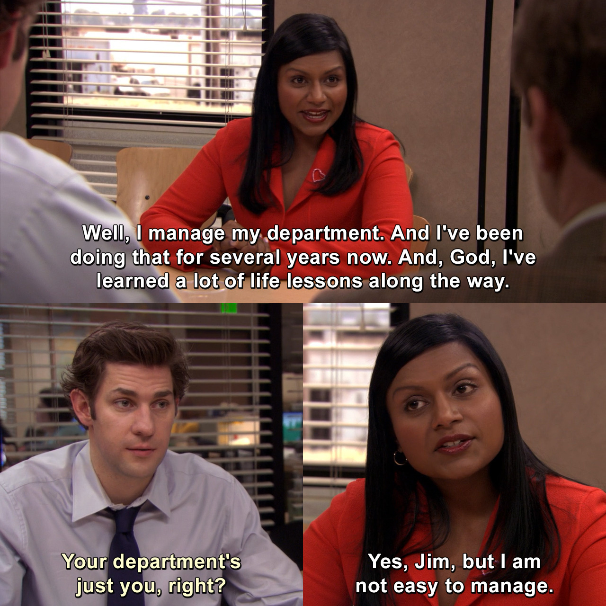
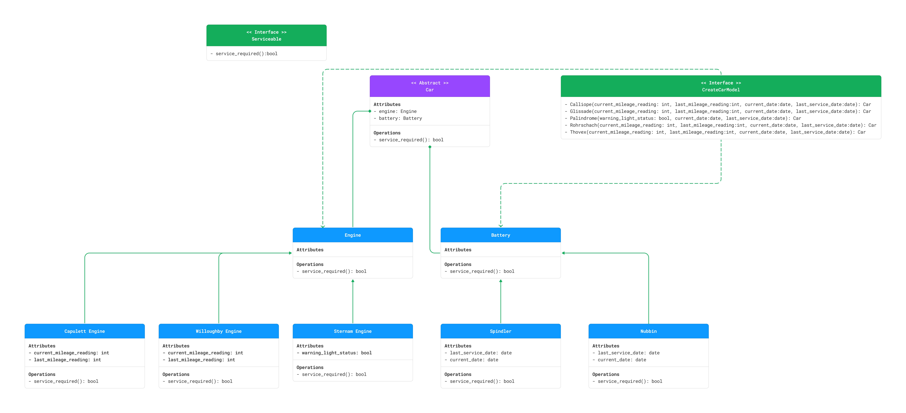
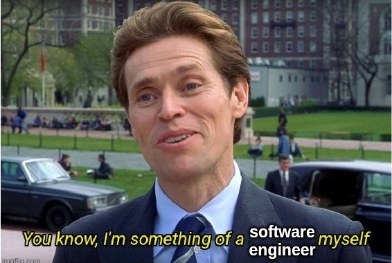

# Lyft Backend Engineering: A Simulation
The code in this project is my solution to Lyft's Virtual Experience Simulation offered on Forage. 

## What The Code Does
The main objective of this code is to build and test a component that can determine if a car in Lyft's rental fleet needs servicing according to criteria provided by the manufacturers. It incorporates the factory method design pattern.


# Thoughts After Completing the Challenge
In the simulation, I was responsible for taking over development of an unfinished project for the Lyft Rentals team.
* Drafted a UML class diagram representing a new reorganized architecture.
* Refactored a messy codebase inherited from another team to accurately reflect my new design.
* Implemented unit tests and added new functionality using test-driven development.

## What I Knew Going In 
Before starting the project, I had written code for my own projects and was familiar with Python, version control, and the regrets of having to deal with messy code. 

Granted, a lot of it was written by me.

But I am always looking for ways to improve my coding skills and get real world experience from "real" Python projects. That's why this virtual experience by Lyft was a valuable one.

## What I Learnt 
### #1. UML Diagrams

One of my resolutions this year was to understand what it means to think visually. I've been trying to build the skill of drawing efficient flowcharts, and so, was delighted to learn about UML diagrams. I had encountered them in the wild before, but hadn't paid close attention. Through a task in the program, I visualised the many lines of code in terms of simpler composite blocks, and learnt the syntax from scratch!

#### Pictures, or it Didn't Happen
Here's the UML diagram I designed after going through the task desrciption:

After adding new features, I updtaed it like so:

### #2. Refactoring
Maintenance. Everything worth having requires it. Even the lines of code on your repo! I learnt about important design patterns such as ```factory_design``` and ```strategy```. Now that I am aware of these patterns, I will recognise them more often in the wild.


### #. Testing, 1...2...3...
*"It is less embarassing if your code fails before your eyes than if your code fails in the eyes of the world"* 
                                                                                            ~ *Captain Obvious*

I had written tests before, and learning how they would work in tandem with new features that would be rolled into production was quite interesting. Having refactored the code, adding new features to the code was a breeze, as I only needed to change a few lines of code. All of this could then be tested in iterations with tests that had the same project structure as the rest of my code. 

## Other Important Lessons I Learnt Along the Way:
Besides the all-important skills of refactoring, test-driven development, version control and designing UML diagrams, I also learnt:

* When designing a system, consider how many times you'd have to change code if a new feature were to be requested by the PM team
* Any project that is longer than a school project is fluid - it will need maintenance
* **Always** test your code




## ⭐Credits
Huge thanks to Kai Pilger [for the photo on this repo's social preview.](https://www.pexels.com/de-de/foto/taxi-uberholt-bus-462867/)
